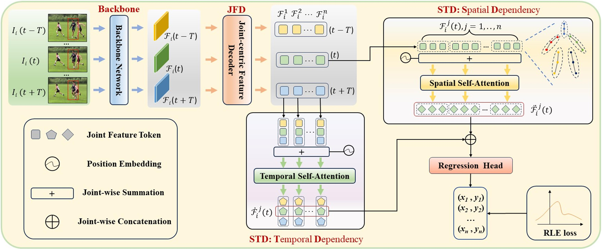

# Video-Based Human Pose Regression via Decoupled Space-Time Aggregation

This repo is the official implementation for **Video-Based Human Pose Regression via Decoupled Space-Time Aggregation**[[arXiv](https://arxiv.org/abs/2403.19926)]. The paper has been accepted to [CVPR 2024](https://cvpr.thecvf.com/Conferences/2024).


## Introduction

By leveraging temporal dependency in video sequences, multi-frame human pose estimation algorithms have demonstrated remarkable results in complicated situations, such as occlusion, motion blur, and video defocus. These algorithms are predominantly based on heatmaps, resulting in high computation and storage requirements per frame, which limits their flexibility and real-time application in video scenarios, particularly on edge devices. In this paper, we develop an efficient and effective video-based human pose regression method, which bypasses intermediate representations such as heatmaps and instead directly maps the input to the output joint coordinates. Despite the inherent spatial correlation among adjacent joints of the human pose, the temporal trajectory of each individual joint exhibits relative independence. In light of this, we propose a novel Decoupled Space-Time Aggregation network (DSTA) to separately capture the spatial contexts between adjacent joints and the temporal cues of each individual joint, thereby avoiding the conflation of spatiotemporal dimensions. Concretely, DSTA learns a dedicated feature token for each joint to facilitate the modeling of their spatiotemporal dependencies. With the proposed joint-wise local-awareness attention mechanism, our method is capable of efficiently and flexibly utilizing the spatial dependency of adjacent joints and the temporal dependency of each joint itself. Extensive experiments demonstrate the superiority of our method. Notably, our approach is the first regression-based method for multi-frame human pose estimation.Compared to previous regression-based single-frame human pose estimation methods, DSTA significantly enhances performance, achieving an 8.9 mAP improvement on PoseTrack2017. Furthermore, our approach either surpasses or is on par with the state-of-the-art heatmap-based multi-frame human pose estimation methods.



## Weights Download
We provide the model weights trained by the method in this paper, which can be downloaded here.
https://drive.google.com/drive/folders/10O1JWFOyMSf5X2glQdMXf2v26CyCrRel?usp=sharing

## Visualizations


### Video Demo


--------------------------------

 


## Environment

The code is developed and tested under the following environment:

- Python 3.8
- PyTorch 1.10.2
- CUDA 11.3

```
conda create -n dsta python=3.8
conda activate dsta
pip install torch==1.10.2+cu113 torchvision==0.11.3+cu113 torchaudio==0.11.0 --extra-index-url https://download.pytorch.org/whl/cu113
pip install -r requirements.txt
```

## Usage
To download some auxiliary materials, please refer to [DCPose](https://github.com/Pose-Group/DCPose).

Follow the [MMPose instruction](mmpose_README.md) to install the mmpose.
### Training
```
cd tools
python run.py --cfg ../configs/posetimation/DSTA/posetrack17/configs.yaml --train 
```
### Evaluation
```
cd tools
python run.py --cfg ../configs/posetimation/DSTA/posetrack17/configs.yaml --val 
```

## Citations

If you find our paper useful in your research, please consider citing:

```bibtex
@InProceedings{He_2024_CVPR,
    author    = {He, Jijie and Yang, Wenwu},
    title     = {Video-Based Human Pose Regression via Decoupled Space-Time Aggregation},
    booktitle = {Proceedings of the IEEE/CVF Conference on Computer Vision and Pattern Recognition (CVPR)},
    year      = {2024},
}
```

## Acknowledgment

Our codes are mainly based on [DCPose](https://github.com/Pose-Group/DCPose). Part of our code is borrowed from [RLE](https://github.com/Jeff-sjtu/res-loglikelihood-regression). Many thanks to the authors!

